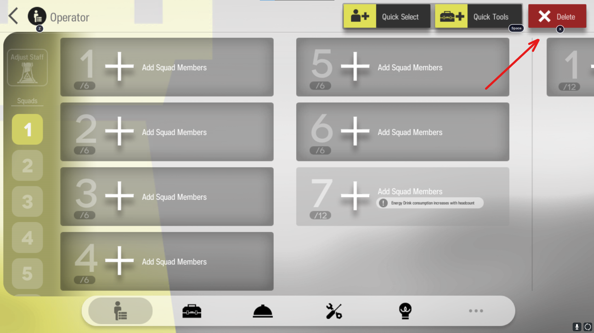
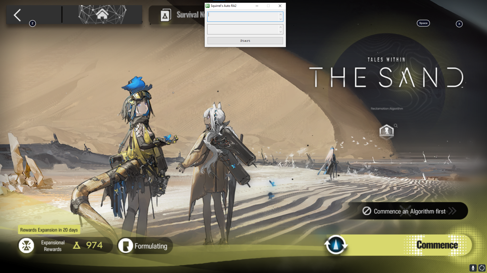
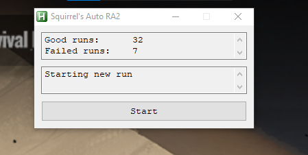

# About
AFK macro to farm **prosperity points** and **tech points** in RA2 on any emulator.

Even though it's not error-proof, the macro should run smoothly most of the time. The only thing which can cause any issues are emulator lags and long "Contacting to neural network".

This macro is possible because the map is always static from run to run, meaning there is an optimized short route to get points fast & restart the run.

# Yields
>[!NOTE]
> One run takes approximately 8 minutes and yeilds:
> - 1000 to 1300 prosperity points
> - 5 to 6 tech points

# Requirements
- AutoHotKey Version 1.1.37. Download: [AHK v1.1.37](https://www.autohotkey.com/download/1.1/AutoHotkey_1.1.37.02_setup.exe)
- Resolution: 1920x1080

# Setup

1. Disable any Color Adjusting Overlays you may have.

2. Set the Arknights emulator window to **Full Screen**.

3. Make sure all squads within RA2 are empty. You can quickly clear all of them with the `Delete` button:

   

4. Set the difficulty to the lowest setting.  

5. Run the [SquirrelsRA2AFK.ahk](./SquirrelsRA2AFK.ahk) script.

6. Move the macro window to the top center of your screen.

   The setup should look like this:
   

7. Click `Start`.

The macro runs indefinitely, but you can always stop it by pressing `Esc`.

The macro window will show what it is doing and also track successful and failed runs:

    

# How it works?

There are some features of RA2 which actully make this possible.
As stated before we always know which nodes to go through to get points. Its worth noting that combats, resource & food gathering nodes may be skipped entirely (entered & exited) to unlock nearby nodes so the only thing left are encounters.

The map of RA2 is massive, but in fact no map moving is needed. Reentering RA2 always resets map to a static position centered around your HQ and minimized map zoom allows to enter all nodes in the route while maintainig static map position.

The score gets updated and you recieve points after every 3rd day, and you can get 3 encounter nodes during first three days. This will yield approximately 1000-1300 prosperity points and 5-6 tech points per run depending on encounters.

Encounters are random, some of them require resources to proceede, but most of them dont. Macro-wise encounters can be divided into 2 groups in general:
- With multiple choices
- Single choice

For multiple choice encounters bottom choice is generally *safe*, meaning no resources are required. Macro uses simple image detection to determine what type of encounter is it and will always attempt to chose bottom option, ensuring successfull runs.

Sadly, there are still encounters which can be only passed if you have certain resources, effectively meaning softlock, based on our approach. Image detection comes into play here ones again. If the encounter is *softlock* one the macro will restart the whole run, meaning no points.
